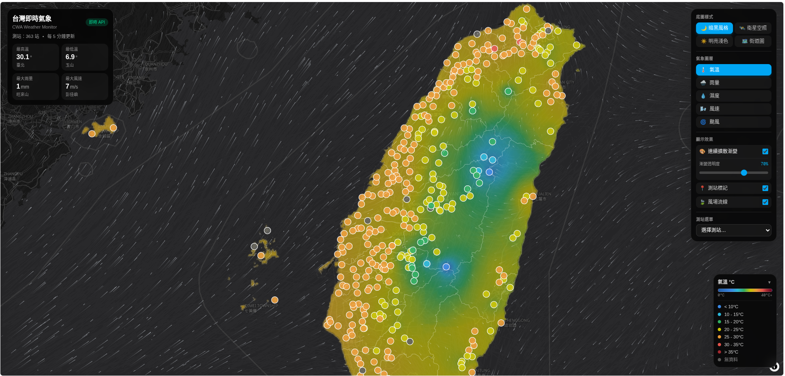
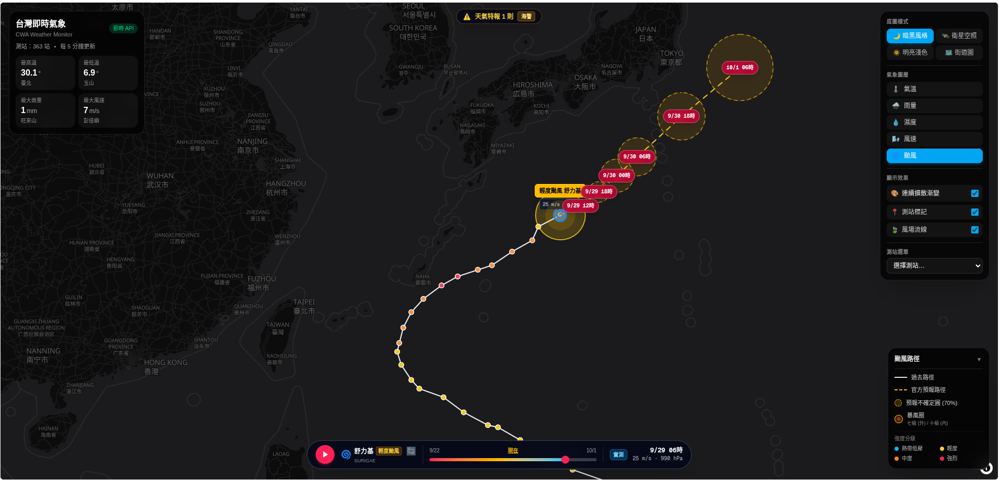

# 台灣即時氣象地圖 (CWA Weather Monitor)

以中央氣象署 (CWA) 即時觀測資料繪製的全台氣象地圖，支援氣溫／雨量／濕度／風速圖層切換，並疊加風場粒子動畫。





**🔗 線上展示：<https://a-iot-hw-1-cwa.vercel.app/>**

AIoT 創新微課程實作作業 (AIot-HW1-CWA)。課程原始版本以 Streamlit + Folium 實作一週預報儀表板，保留於 [BlueET1/AIot-HW1-CWA](https://github.com/BlueET1/AIot-HW1-CWA)；本專案為其進階版，改以即時觀測資料與 MapLibre GL 重新實作。

## 功能

- **多樣底圖切換**：
  - 🌙 **暗黑風格**：OpenFreeMap 暗色向量圖磚
  - 🛰️ **衛星空照**：Esri 高解析度空照衛星影像
  - ☀️ **明亮淺色**：OpenFreeMap 簡約淺色向量圖磚
  - 🗺️ **街道圖**：OpenFreeMap 繁體中文向量街道地圖
- **高解析度連續氣象擴散漸變圖**：以 450×500（22.5 萬像素）高解析度 IDW 逆距離權重演算法生成全台連續平滑漸變色階，採用精確 Web Mercator 墨卡托正逆投影轉換，並以 4,000+ 點高精細海岸線向量幾何裁切，嚴密貼合台灣陸地與島嶼邊界，海面清透無溢色，並疊加細緻縣市界線，支援透明度即時調節
- **363 個即時測站**：CWA `O-A0003-001`（局屬氣象站 10 分鐘綜觀觀測），每 5 分鐘自動更新
- **四種氣象圖層**：氣溫、雨量、濕度、風速，各有獨立色階、連續漸變條與圖例
- **自適應風場粒子動畫**：以 [Open-Meteo](https://open-meteo.com/) 格點風場資料驅動之 canvas 粒子系統，導入非線性風速壓縮平衡海陸速度差，隨底圖自動切換明亮/暗黑混合渲染模式
- **即時颱風路徑與時間軸播放器**：
  - 串接中央氣象署最新活動熱帶氣旋資料集（`W-C0034-005`）與警報單（`W-C0034-001`）
  - 過去實測路徑（實線）與官方未來預報路徑（虛線）
  - 70% 預報不確定範圍圓與各預報時效標記
  - 七級／十級暴風圈真實地理多邊形投影
  - 自動最佳化相機邊界（Fit Bounds），切換時自動隱藏台灣觀測資料
  - 底部互動式時間軸播放器（Typhoon Timeline Player），支援拖曳、自動播放與即時 🔄 重新整理
  - 專屬颱風路徑與強度分級圖例
- **測站詳細資訊**：點擊地圖標記或從選單挑選測站

## 技術棧

Next.js 16 (App Router) · TypeScript · Tailwind CSS v4 · MapLibre GL JS

## 本機開發

```bash
npm install
```

建立 `.env.local`，填入你自己在[氣象資料開放平臺](https://opendata.cwa.gov.tw/)申請的授權碼：

```
CWA_API_KEY=CWA-XXXXXXXX-XXXX-XXXX-XXXX-XXXXXXXXXXXX
```

```bash
npm run dev
```

開啟 http://localhost:3000。

## 部署

部署於 Vercel。API 金鑰設定在專案的 Environment Variables（變數名稱 `CWA_API_KEY`，不加 `NEXT_PUBLIC_` 前綴），僅於伺服器端的 Route Handler 使用，不會被打包進前端。

## 實作備註

- `public/maplibre-gl-worker.mjs` 與 `public/maplibre-gl-shared.mjs` 是從 `node_modules/maplibre-gl/dist/` 原封不動複製出來的。MapLibre 透過 `new URL(..., import.meta.url)` 載入 Worker，Turbopack 與 webpack 都無法讓這組檔案在正式環境被正確取用，因此改為自行託管並以 `setWorkerUrl()` 指定。升級 maplibre-gl 時需一併更新這兩個檔案。
- 地圖容器使用行內樣式定位，而非 Tailwind 的 `absolute`。MapLibre 會在容器上加入 `.maplibregl-map`，其未分層的 `position: relative` 會蓋過 Tailwind v4 置於 `@layer utilities` 的 `.absolute`（未分層樣式優先權高於分層樣式），導致容器高度塌陷為 0。

## 授權

MIT
